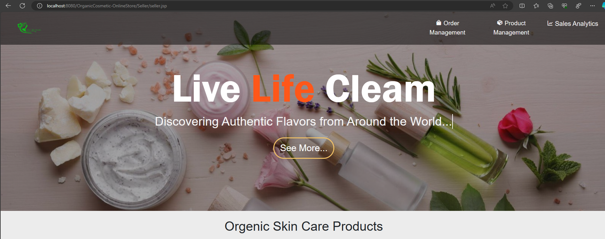
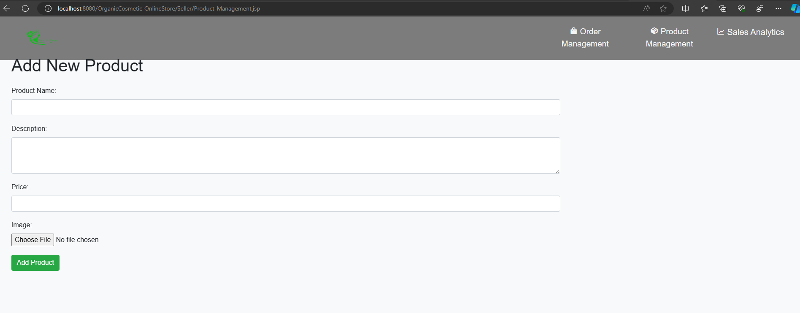

<div align="center">
  
  
  
  
 
  <br />
  <br />

  <h2 align="center">Organic Cosmetics - organic done differently!</h2>

Organic Cosmetics is a concept wed development project by a group of 10 students. This project is made with Java, built with JDK and locally running on Apache TomCat.

  <a href="#"><strong>➥ Live Demo of our website</strong></a>

</div>

<br />

### Demo Screeshots


### Prerequisites

Before you run locally, ensure you have met the following requirements:

* [Git](https://git-scm.com/downloads "Download Git") must be installed on your operating system.
* [JDK 19](https://jdk.java.net/archive/ "Download JDK19 from archive") must be installed
* Better works with Apache NetBeans IDE 17 or NetBeans IDE 8.2
*  [MySQL connector java 5.1.23 bin.jar](https://downloads.mysql.com/archives/get/p/3/file/mysql-connector-java-5.1.23.tar.gz)
alternatively, available in 'web/WEB-INF/lib/mysql-connector-java-5.1.23-bin.jar'


### Run Locally

To run **Organic Cosmetics** locally, run this command on your git bash:

Linux and macOS:

```bash
sudo git clone https://github.com/KSDeshappriya/OrganicCosmetic-OnlineStore.git
```

Windows:

```bash
git clone https://github.com/KSDeshappriya/OrganicCosmetic-OnlineStore.git
```


### Team
1. 

### Contact

We are busy with your competitors, but still we have some time to connect, buzz me on [Twitter](https://www.twitter.com/gthuvaDEV) / [LinkedIn](https://www.linkedin.com/in/0xgthuva/) / [Instagram](https://www.instagram.com/0xgthuva.jpg/).

### License
* GNU GPL v3.0 (https://www.gnu.org/licenses/gpl-3.0.en.html)

Good artists copy, Great artists don't steal, they get inspire from others work.

### More Screeshots






